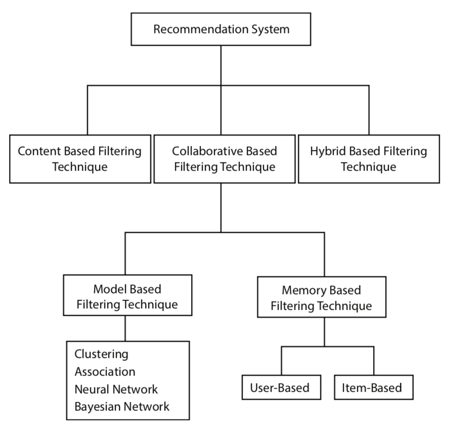
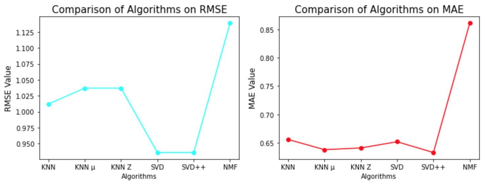

# Recommender System for Amazon Items

## 1. Business portion of 
E-commerce, an activity of buying or selling items (products) on online services, has been populated. We cannot deny the fact that Amazon is one of the biggiest E-commerce company. From the millions items in online stores, it is hard to believe which item would be the best for customers. Given information of users and items, recommending the items in personal preference is a way to generate tremendous revenue with increment of user retention and overall user satisfaction. 

## 2. Dataset
The [dataset](https://nijianmo.github.io/amazon/index.html) includes reviews "ratings-only" (ratings, text, helpfulness votes) as a csv file and item metadata "5-core" (descriptions, category information, price, brand, and image features) as a json file. The dataset is categorically divided; for this project, category of **Video Games** was chosen. For the practical prupose, item metadata of json file was loaded. 

> "5-core" (i.e., dense subsets): These data have been reduced to extract the 5-core, such that each of the remaining users and items have 5 reviews each.

**Sample review**:
{
  "reviewerID": "A2SUAM1J3GNN3B",
  "asin": "0000013714",
  "reviewerName": "J. McDonald",
  "vote": 5,
  "style": {
    "Format:": "Hardcover"
  },
  "reviewText": "I bought this for my husband who plays the piano.  He is having a wonderful time playing these old hymns.  The music  is at times hard to read because we think the book was published for singing from more than playing from.  Great purchase though!",
  "overall": 5.0,
  "summary": "Heavenly Highway Hymns",
  "unixReviewTime": 1252800000,
  "reviewTime": "09 13, 2009"
}

where

- reviewerID: ID of the reviewer, e.g. A2SUAM1J3GNN3B
- asin: ID of the product, e.g. 0000013714
- reviewerName - name of the reviewer
- vote: helpful votes of the review
- style: a disctionary of the product metadata, e.g., "Format" is "Hardcover"
- reviewText: text of the review
- overall: rating of the product
- summary: summary of the review
- unixReviewTime: time of the review (unix time)
- reviewTime: time of the review (raw)
- image: images that users post after they have received the product

## 3. Recommender System
A recommender system is a technique to suggest the relevant items to users, based on their preference. There are 3 types; 1) content-based filtering, 2) collaborative filtering, 3) hybrid systems. 

This project focus on collaborative filtering by using package Surprise. More evaluation metrics are added by creating a class on the top of Surprise. Detail evaluation metrics can be seen in [capstone2_recsys_ver2.ipynb](https://github.com/pnut2357/Rec-Sys-Amazon/blob/main/capstone2_recsys_ver2.ipynb). Based on 
RMSE and MAE, SVD++ was chosen as the best recommendation algorithm on the Amazon game data. 

|                ALGORITHM               ||       RMSE      |     MAE    |
| -----------------: | -----------------: | --------------: | ---------: |
|      Memory-based  |         KNN        |        1.012    |    0.656   |
|      ^             |   KNN with Means   |        1.037    |    0.638   |
| ^                  |  KNN with Z-Score  |        1.037    |    0.641   |
|      Model-based   |         SVD        |        0.936    |    0.652   |
| ^                  |         SVD++      |        0.936    |    0.633   |
| ^                  |         NMF        |        1.139    |    0.861   |

